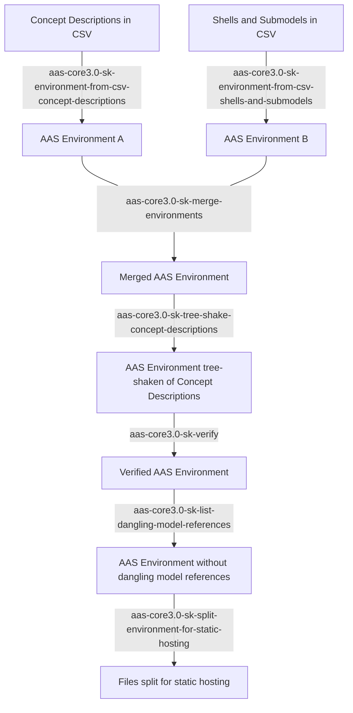

# aas-core3.0-cli-swiss-knife

Provide a set of command-line utilities to manipulate and convert AAS environments.

[](https://github.com/aas-core-works/aas-core3.0-cli-swiss-knife/actions/workflows/ci.yml)

## Table of Contents

* [Quickstart](#Quickstart)
* [Philosophy](#Philosophy)
* [Workflow](#Workflow)
* [Installation](#Installation)
* [aas-core3.0-sk-environment-from-csv-concept-descriptions]
* [aas-core3.0-sk-environment-from-csv-shells-and-submodels]
* [aas-core3.0-sk-merge-environments]
* [aas-core3.0-sk-tree-shake-concept-descriptions]
* [aas-core3.0-sk-verify]
* [aas-core3.0-sk-list-dangling-model-references]
* [aas-core3.0-sk-split-environment-for-static-hosting]

[aas-core3.0-sk-environment-from-csv-concept-descriptions]: #aas-core30-sk-environment-from-csv-concept-descriptions
[aas-core3.0-sk-environment-from-csv-shells-and-submodels]: #aas-core30-sk-environment-from-csv-shells-and-submodels
[aas-core3.0-sk-merge-environments]: #aas-core30-sk-merge-environments
[aas-core3.0-sk-tree-shake-concept-descriptions]: #aas-core30-sk-tree-shake-concept-descriptions
[aas-core3.0-sk-verify]: #aas-core30-sk-verify
[aas-core3.0-sk-list-dangling-model-references]: #aas-core30-sk-list-dangling-model-references
[aas-core3.0-sk-split-environment-for-static-hosting]: #aas-core30-sk-split-environment-for-static-hosting

## Quickstart

1) Write your concept descriptions (a.k.a. "data dictionaries") in CSV, and convert them to an AAS environment using [aas-core3.0-sk-environment-from-csv-concept-descriptions].
2) Capture the submodels and asset administration shells in CSV, and convert them to an environment using [aas-core3.0-sk-environment-from-csv-shells-and-submodels].
3) Merge the asset administration shells, submodels and concept descriptions into a single AAS environment using [aas-core3.0-sk-merge-environments].
4) Shake away the concept descriptions that you don't need in the merged environment using [aas-core3.0-sk-tree-shake-concept-descriptions].
5) Verify that there are no mistakes with [aas-core3.0-sk-verify].
6) If you want your environment to be completely self-containing, check that you do not have any dangling model references with [aas-core3.0-sk-list-dangling-model-references].
7) Split the environment to separate files that can be readily served by your web server using [aas-core3.0-sk-split-environment-for-static-hosting].
8) Configure your web server to serve `index.json` in directories; see [Static Hosting].

[Static Hosting]: #static-hosting

## Philosophy

We want to provide a set of command-line tools which will allow you to serve static data in AAS format in a breeze.

Each tool should do one thing, and do it well, following [Unix philosophy].

We strive to cover the "80%" cases, and embrace simplicity over versatility.
For more complex uses cases which are off-the-beaten path as we imagined it, you have to manually edit the data, or implement your own backend.
Our toolkit can not and does not aim to fulfill the scope of a complex AAS platform.

[Unix philosophy]: https://en.wikipedia.org/wiki/Unix_philosophy

## Workflow

### Asset Administration Shells, Submodels, and Concept Descriptions

You start by capturing asset administration shells, submodels and concept descriptions in parallel, in two separate tables.
Usually, you use Excel to capture this data and export the tables to [comma-separated values] ([CSV]), which our toolkit operates on.

[comma-separated values]: https://en.wikipedia.org/wiki/Comma-separated_values
[CSV]: https://en.wikipedia.org/wiki/Comma-separated_values

Once the data is captured, you convert the tables from [CSV] to [AAS environments] in [JSON format] using [aas-core3.0-sk-environment-from-csv-concept-descriptions] and [aas-core3.0-sk-environment-from-csv-shells-and-submodels], respectively.

[AAS environments]: https://aas-core-works.github.io/aas-core-meta/v3/Environment.html
[JSON format]: https://github.com/admin-shell-io/aas-specs/tree/master/schemas/json

Finally, you merge the two environments into one using [aas-core3.0-sk-merge-environments].
Now you should have a single JSON file, representing your self-contained [AAS environment].

[AAS environment]: https://aas-core-works.github.io/aas-core-meta/v3/Environment.html

### Re-using Concept Descriptions

As you work more and more with AAS, you will start reusing concept descriptions, and organizing them into different "data dictionaries".
For example, you can organize your data dictionaries into different environments which you readily re-use by supplying them to [aas-core3.0-sk-merge-environments].

However, before you publish your specific environment, you usually do not want to publish the whole data dictionary, but only the necessary concept descriptions which you reference from your asset administration shells and submodels.
We provide a ["tree-shaking"] tool to that end, [aas-core3.0-sk-tree-shake-concept-descriptions].

["tree-shaking"]: https://en.wikipedia.org/wiki/Tree_shaking

The tree-shaker will analyze all instances of [HasSemantics] in the environment, and keep only the concept descriptions which have been given as model references in [semantic IDs].

[HasSemantics]: https://aas-core-works.github.io/aas-core-meta/v3/Has_semantics.html
[semantic IDs]: https://aas-core-works.github.io/aas-core-meta/v3/Has_semantics.html#property-semantic_ID

### Verification

While an AAS environment can well serialize to JSON, but still be invalid according to [the constraints of the meta-model].
If you violate the constraints, your clients might not be able to use the data, even though they can de-serialize it.

[the constraints of the meta-model]: https://aas-core-works.github.io/aas-core-meta/v3/index.html

To check that the constraints are maintained, use [aas-core3.0-sk-verify].

As our toolkit lacks access to your AAS infrastructure such as registries or language models, it can check only the constraints on your environment data.
Since the scope of our tools is to cover the "80%" case, this is practically never really a problem.
If you need the complex "20%", please make sure you perform enough integration tests.

### Dangling References

In addition to constraints, you might also want to check that you do not have dangling model references in your environment.
Unless you are referencing AAS instances *outside* your environment, a dangling reference is most probably a mistake.

You check for dangling references using [aas-core3.0-sk-list-dangling-model-references].
The tool will analyze all [Reference]'s with the reference type [ModelReference], and make sure it can be accessed in your environment.

[Reference]: https://aas-core-works.github.io/aas-core-meta/v3/Reference.html
[ModelReference]: https://aas-core-works.github.io/aas-core-meta/v3/Reference_types.html#literal-Model_reference

### Static Hosting

Since your data is static, you can implement an AAS server simply using any off-the-shelf web server such as [Nginx] or [Apache HTTP Server].

The tool [aas-core3.0-sk-split-environment-for-static-hosting] allows you to split an AAS environment into smaller JSON files and generate an index JSON file.
The files follow the convention of an AAS server, and are expected to interoperate with AAS clients.

Mind that web servers usually expect `index.html` or `index.htm` to serve the index page, but the AAS servers are expected to serve an index in JSON format.
To fulfill the expected behavior, you have to set your web server to serve `index.json` as index page.
Additionally, the HTTP headers in the index pages should include the content type to `application/json`.

[Nginx]: https://en.wikipedia.org/wiki/Nginx
[Apache HTTP Server]: https://en.wikipedia.org/wiki/Apache_HTTP_Server

### Overview



## Installation

Simply download and extract the ZIP archive from the [Releases].
The tools can be immediately used and need no dependencies.

[Releases]: https://github.com/aas-core-works/aas-core3.0-cli-swiss-knife/releases

If you use the toolkit often, you might want to add the directory to your [PATH].

[PATH]: https://en.wikipedia.org/wiki/PATH_(variable)

# aas-core3.0-sk-environment-from-csv-concept-descriptions

<!-- Help starts: out\aas-core3.0-sk-environment-from-csv-concept-descriptions.exe --help -->
```
Description:
  Translate concept descriptions, captured as a pre-defined CSV file, 
  into an AAS environment serialized to JSON.

  The expected header is:
  ID,Preferred Name,Short Name,Unit,Symbol,Definition,Source of Definition

Usage:
  aas-core3.0-sk-environment-from-csv-concept-descriptions [options]

Options:
  --concept-descriptions <concept-descriptions> (REQUIRED)  
    One or more files containing the information about the concept descriptions 
    in CSV format
  --output <output> (REQUIRED)                              
    The JSON file containing the AAS Environment; if '-', output to STDOUT
  --version                                                 
    Show version information
  -?, -h, --help                                            
    Show help and usage information
```
<!-- Help ends: out\aas-core3.0-sk-environment-from-csv-concept-descriptions.exe --help -->

The tool aas-core3.0-sk-environment-from-csv-concept-descriptions converts a table to instances of [Concept Description]'s and embeds [Data Specification IEC 61360] in them.

[Concept Description]: https://aas-core-works.github.io/aas-core-meta/v3/Concept_description.html
[Data Specification IEC 61360]: https://aas-core-works.github.io/aas-core-meta/v3/Data_specification_IEC_61360.html

We chose by design to put focus on the data specification.
In particular, the column `Definition` refers to [the definition of the data specification], and *not* to the description of the concept description.
At the moment, we leave [the description of the Concept Description] empty, but this might change in the future.

[the definition of the data specification]: https://aas-core-works.github.io/aas-core-meta/v3/Data_specification_IEC_61360.html#property-definition
[the description of the Concept Description]: https://aas-core-works.github.io/aas-core-meta/v3/Concept_description.html#property-description

While data specifications allow for definitions in different languages, we assumed only English for simplicity of the entry.

This interface is admittedly opinionated, and other approaches are of course equally thinkable.
Please [create an issue] to give us your feedback how you expect this interface to look like.

[create an issue]: https://github.com/aas-core-works/aas-core3.0-cli-swiss-knife/issues/new

# aas-core3.0-sk-environment-from-csv-shells-and-submodels

<!-- Help starts: out\aas-core3.0-sk-environment-from-csv-shells-and-submodels.exe --help -->
```
Description:
  Translate asset administration shells and submodels from a pre-defined CSV table to 
  an AAS environment serialized to JSON.

  The expected header is:
  Asset Administration Shell ID,Submodel ID,Submodel Element,ID-short,Value,Data Type,
  Content Type,Min,Max,Semantic ID

Usage:
  aas-core3.0-sk-environment-from-csv-shells-and-submodels [options]

Options:
  --assets-and-submodels <assets-and-submodels> (REQUIRED)  
    One or more files containing the information about the asset administration shells 
    and submodels in CSV format
  --output <output> (REQUIRED)                              
    The JSON file containing the AAS Environment; if '-', output to STDOUT
  --version                                                 
    Show version information
  -?, -h, --help                                            
    Show help and usage information
```
<!-- Help ends: out\aas-core3.0-sk-environment-from-csv-shells-and-submodels.exe --help -->

With aas-core3.0-sk-environment-from-csv-shells-and-submodels, you capture asset administration shells, submodels *and* the submodel elements, all in the same line.
The tool will automatically extract these three separate entities and associate them accordingly in the resulting AS environment.

The column `Submodel Element` determines the *class* of the submodel element.
Currently, we support [File], [Property], and [Range].

[File]: https://aas-core-works.github.io/aas-core-meta/v3/File.html
[Property]: https://aas-core-works.github.io/aas-core-meta/v3/Property.html
[Range]: https://aas-core-works.github.io/aas-core-meta/v3/Range.html

Depending on the class of the submodel element, you have to specify different columns.
For example, the column `Semantic ID` can be specified for all the classes of submodel elements.
However, `Content Type` is to be specified only for [File]'s, while `Min` and `Max` apply only to [Range].

Please see the generated documentation of the meta-model to determine which columns are applicable: [File], [Property], [Range].  

# aas-core3.0-sk-merge-environments

<!-- Help starts: out\aas-core3.0-sk-merge-environments.exe --help -->
```
Description:
  Merge multiple AAS environments into one.

Usage:
  aas-core3.0-sk-merge-environments [options]

Options:
  --environments <environments> (REQUIRED)  
    Paths to two or more AAS environments serialized to JSON to be merged
  --output <output> (REQUIRED)              
    Path to the merged environment; if '-', the output is written to STDOUT
  --version                                 
    Show version information
  -?, -h, --help                            
    Show help and usage information
```
<!-- Help ends: out\aas-core3.0-sk-merge-environments.exe --help -->

# aas-core3.0-sk-tree-shake-concept-descriptions

<!-- Help starts: out\aas-core3.0-sk-tree-shake-concept-descriptions.exe --help -->
```
Description:
  Remove concept descriptions which are not directly referenced as model references 
  through semantic IDs.

Usage:
  aas-core3.0-sk-tree-shake-concept-descriptions [options]

Options:
  --environment <environment> (REQUIRED)  
    Path to the AAS environment serialized to JSON from which we remove 
    the concept descriptions not referenced in any semantic ID
  --output <output> (REQUIRED)            
    Path to the environment without unreferenced concept descriptions; 
    if '-', the output is written to STDOUT
  --version                               
    Show version information
  -?, -h, --help                          
    Show help and usage information
```
<!-- Help ends: out\aas-core3.0-sk-tree-shake-concept-descriptions.exe --help -->

# aas-core3.0-sk-verify

<!-- Help starts: out\aas-core3.0-sk-verify.exe --help -->
```
Description:
  Verify that the AAS environment satisfies the meta-model constraints.

  Only constraints are checked that can be enforced without external dependencies 
  such as registry or language models.

Usage:
  aas-core3.0-sk-verify [options]

Options:
  --environment <environment> (REQUIRED)  
  Path to the AAS environment serialized to JSON to be verified
  -version                               
  Show version information
  -?, -h, --help                          
  Show help and usage information
```
<!-- Help ends: out\aas-core3.0-sk-verify.exe --help -->

# aas-core3.0-sk-list-dangling-model-references

<!-- Help starts: out\aas-core3.0-sk-list-dangling-model-references.exe --help -->
```
Description:
  List model references in the environment which are not contained in it

Usage:
  aas-core3.0-sk-list-dangling-model-references [options]

Options:
  --environment <environment> (REQUIRED)  
  An AAS environment serialized as a JSON file to be searched for dangling model 
  references
  --version                               
  Show version information
  -?, -h, --help                          
  Show help and usage information
```
<!-- Help ends: out\aas-core3.0-sk-list-dangling-model-references.exe --help -->

# aas-core3.0-sk-split-environment-for-static-hosting

<!-- Help starts: out\aas-core3.0-sk-split-environment-for-static-hosting.exe --help -->
```
Description:
  Split an AAS environment into multiple files so that they can be readily served as 
  static files.

Usage:
  aas-core3.0-sk-split-environment-for-static-hosting [options]

Options:
  --environment <environment> (REQUIRED)
  Path to the AAS environment serialized as a JSON file to be split into different files 
  for static hosting
  --output-dir <output-dir> (REQUIRED)      
  Path to the output directory
  --version                                 
  Show version information
  -?, -h, --help                            
  Show help and usage information
```
<!-- Help ends: out\aas-core3.0-sk-split-environment-for-static-hosting.exe --help -->

Please see [Static Hosting] for information about how to set up your web server.
